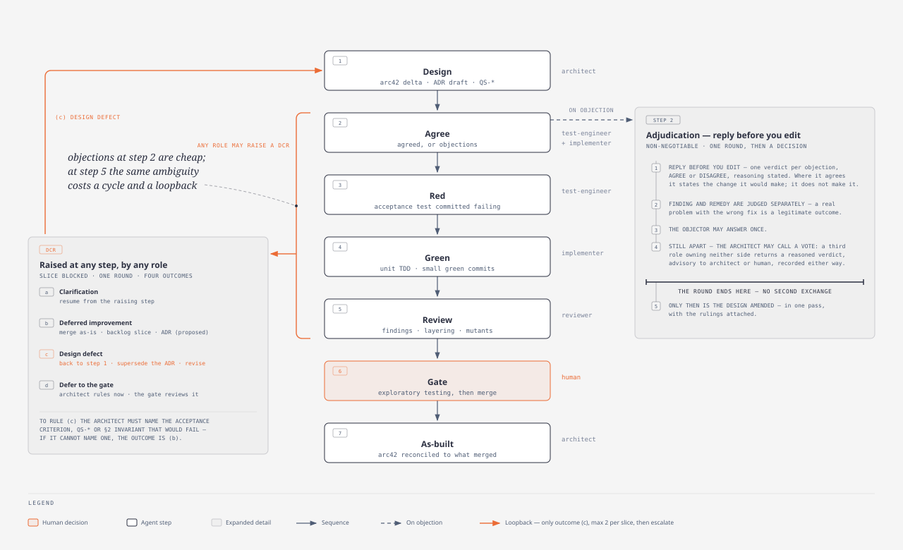
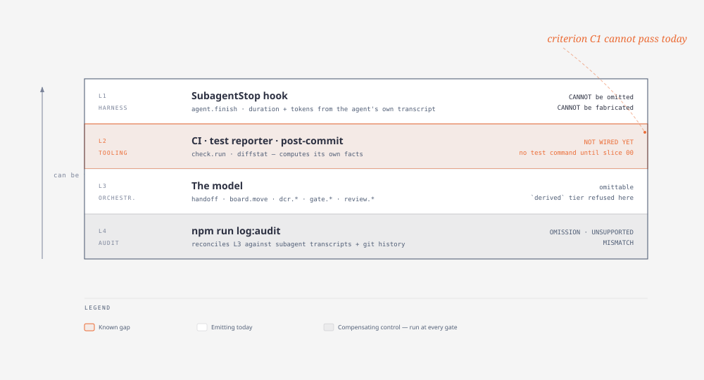

# Agent Team Methodology

**Project:** Keyloop Technical Assessment — Scenario A, Unified Service Scheduler (backend, TypeScript/Node/PostgreSQL)
**Status:** Agreed, pre-implementation · **Audience:** humans. Machine-facing files are derived from this — see §12.

How a team of AI agents and one human engineer build software together: who decides what, in what
order, under what evidence requirements, and how it is observed.

Designed against two failure modes. **Unowned generation** — accepting plausible AI output because
it looks plausible; every claim here must be checkable by something other than an agent's
assertion. **Methodology theater** — ceremonies that signal rigor without producing it; §11 measures
whether each rule earned its cost.

---

## 0. Prerequisites

| Requirement | Why | Notes |
|---|---|---|
| Node + npm | Tooling and the application stack | Versions pinned at Gate B |
| Docker | Testcontainers and the local `grafana/otel-lgtm` stack | Tests will not run without it |
| Python ≥ 3.10 | The `diagram-design` validators | 3.12 verified |
| `diagram-design` plugin | Presentation diagrams (phase 2, refreshed phase 6) | Registered in the repo's `.claude/settings.json`; opening the repo prompts to install from `cathrynlavery/diagram-design`. Third-party code — a deliberate choice, stated here rather than discovered |
| Playwright *(optional)* | PNG export only | `pip install playwright && playwright install chromium`. SVG export, which is what arc42 uses, does not need it |

Diagram output is committed as both `.html` and `.svg`, so nothing above is required merely to
*read* the design document.

---

## 1. Principles

Everything below derives from these. Resolve uncovered situations by returning to them.

| | Principle | Consequence |
|---|---|---|
| **P1** | Human attention is the bottleneck, not agent capacity | Kanban with WIP 1; gates only where the human's answer changes the outcome. A rubber-stamped gate is worse than none |
| **P2** | One source of truth per concern | Second views are *generated*, never maintained alongside |
| **P3** | Executable beats asserted | Constraints in the DB, layering in CI, test quality via mutation score, "done" via a script |
| **P4** | Independence where it counts | Spent at the boundary that defines *done*; deliberately **not** on unit tests, which are a design tool |
| **P5** | Evidence over narration | Anything derivable is derived; narration is attributed and visually marked |
| **P6** | Flow over perfection | Correct-under-the-agreed-design ships; improvements become debt. Only incorrectness stops the line |

---

## 2. Roles

Defined by what they may **decide**, not what they produce.

| Role | Decides | Never | Model |
|---|---|---|---|
| **Human** | Scope, acceptance criteria, quality goals, all trade-offs; overrides anyone | — | — |
| **Orchestrator** | Sequencing, slicing, who convenes. Sole writer of board and event log | Decide architecture; write code | — |
| **Architect** | Interfaces, layering, data model, patterns, open tech choices; adjudicates DCRs | Change scope or AC; write code or tests | Opus |
| **Test-engineer** | How *done* is asserted: acceptance, contract, property, concurrency tests | Write unit tests; see the implementation first | Sonnet |
| **Implementer** | Internal design within the architect's constraints | Edit acceptance/contract/property tests; edit arc42 | Sonnet |
| **Reviewer** | Whether a diff conforms; may block a merge | Change the design — may only raise a DCR | Opus |
| **Scribe** | Nothing; records | Claim anything not supported by an artifact | Sonnet |

Deliberately absent: a separate analyst (requirements and design are one conversation at this size)
and a product owner (that is the human).

**Resolution:** one round of discussion, then the responsible role decides. No multi-turn agent
debate — that is spend, not rigor. Unresolved after one round escalates to the human.

---

## 3. Phases

```
0 FOUNDATION ─▶ 1 REQUIREMENTS ─A─▶ 2 ARCHITECTURE ─B─▶ 3 BACKLOG ─C─▶
   4 PILOT + RETRO ─D─▶ 5 SLICE LOOP ×n ─E each─▶ 6 CONSOLIDATION ─F─▶ 7 VIDEO
```

| Phase | Who | Produces | Gate |
|---|---|---|---|
| **0 Foundation** | human + orchestrator | Scaffold, constitution, agent definitions, hooks, event log, board seeded with a synthetic slice | Human reviews the instrument |
| **1 Requirements** | architect | arc42 §1–§3 + assumptions and open questions | **A** — human resolves ambiguity; answers become ADRs |
| **2 Architecture** | architect | arc42 §4–§8, §10, §11; founding ADRs; `.dependency-cruiser.js` | **B** — plan-mode approval; stack confirmed |
| **3 Backlog** | orchestrator + human | 12–14 slice files | **C** — approve scope and ordering |
| **4 Pilot** | all | Slice 00 end-to-end, then retro against pre-registered criteria | **D** — tune the machine, or proceed |
| **5 Slice loop** | all | The system, one slice at a time (§6) | **E** — every slice |
| **6 Consolidation** | architect + scribe | As-built arc42, presentation diagrams, `system-design.md`, README, §13 narrative, as-designed/as-built delta | **F** — final read |
| **7 Video** | scribe + human | Shot list from real artifacts | — |

Phase 0 is instrumentation-first because observability added later never gets added, and the pilot
is worthless unobserved. Phase 4 exists because the methodology is itself untested — running the
full pipeline on a trivial slice against **criteria written beforehand** is cheaper than discovering
at slice 9 that it does not work.

---

## 4. Documentation

| Concern | Home | Owner |
|---|---|---|
| Architecture — **the SSOT** | `docs/arc42/` | architect |
| Decisions | `docs/adr/` (MADR) | architect |
| Units of work | `docs/slices/` (doubles as PR body) | orchestrator |
| Team telemetry | `docs/team-log/` | orchestrator |
| Where the project is | `docs/STATUS.md` (generated) | orchestrator |
| Build/run/test, AI narrative | `README.md` | scribe |
| Operative rules | `CLAUDE.md` | human (derived, §12) |

**arc42**, all twelve sections retained for recognisability; several deliberately thin and saying
so, which reads as judgement where invented detail reads as padding. One added section, honestly
numbered outside the standard twelve: **§13 AI Collaboration**. Weight goes to §4 (the
exclusion-constraint decision, with check-then-act named and rejected), §6 (concurrent-booking
sequence), §8 (observability, persistence, testability), §10, §11.

**Traceability chain** — walkable both ways, and CI verifies every `QS-*` names a real test:

```
arc42 §10 quality scenario → slice acceptance criterion → test name → CI result
```

A quality attribute not traceable to a test is aspiration; a test not traceable to a scenario is
unexplained.

**Three tiers of trust.** *Generated* (cannot drift): module graph from `dependency-cruiser`,
OpenAPI from route schemas, §11's debt register from `proposed` ADRs and deferred slices,
`system-design.md` from section files. *Enforced* (CI): the assembly matches its section files,
every diagram has its export and every diagram link resolves, the event log is append-only and
schema-valid. Link integrity beyond diagrams, ADR existence and `QS-*` → test are **claimed here
but not yet enforced** — arc42 §11.2 R-8 carries the gap.
*Written* (drifts, so keep small and about **why**): §4, §9, §11 commentary.

**As-designed → as-built.** arc42 is written as-designed at Gate B and corrected at each merge. The
delta is kept deliberately: where the plan was wrong is stronger evidence than a plan that pretends
it never was.

**ADRs are immutable** — never edited, only superseded by one that references them. MADR, extended
with `proposed-by` / `decided-by` / `ai-input`, which is direct evidence for the AI-verification
criterion. *Considered Options* must be populated honestly; one option considered is a note, not a
decision record.

**Diagrams.** Presentation diagrams (architecture, sequence, data model, deployment) use the
`diagram-design` skill. Refreshed once at phase 6, not per slice, since SVG is not cheaply diffable
and each drawing costs several hundred lines of mandatory reference reading. Derived diagrams
(module graph, board) stay generated.

**Both the `.html` source and the exported `.svg` are committed**, and arc42 references the `.svg`.
An evaluator reading the repository on GitHub has no plugin installed; without the exported file the
§6 runtime view is invisible to exactly the audience it exists for. CI enforces that much: every
committed `.html` has its exported `.svg`, and every diagram link under `docs/` resolves.

**Layout itself is not enforced.** The skill's `self_check.py` and `verify-geometry.py` do validate
it — no clipped label masks, no overlapping nodes — but they live in the `diagram-design` plugin
cache outside the repository, so a fresh checkout does not contain them and CI cannot run them. The
architect runs both at authoring time; that result is *reported*, not proven. Diagrams therefore sit
in the **enforced** tier for existence and linkage, and the **written** tier for layout. Vendoring
the two scripts was considered and rejected: ~560 lines of third-party code forked into a repository
that is itself under assessment, to enforce a property of drawings refreshed once at phase 6.
Recorded as arc42 §11.2 R-8.

*Rejected: a second specification framework.* Spec-Kit and BMAD both overlap arc42; adopting either
alongside it creates two answers to "what is a task" plus a pipeline to keep them in sync. What was
lost — Spec-Kit's `/clarify` and `/analyze` — is reproduced as Gate A and the reviewer.

---

## 5. Work management

Kanban, not Scrum — fixed iterations exist to batch human coordination, and there is no team to
coordinate (P1). **WIP limit 1.** Board columns are the TDD cycle, so the board *displays* that a
failing test preceded implementation:

```
ready · speccing · red · green · review · done          (blocked is orthogonal)
```

**One writer:** the orchestrator owns every transition. No agent marks its own work done.

```yaml
---
id: 03
title: Availability query
status: ready
depends_on: [01, 02]
arc42: ["§5.2", "§8.3"]           # sections this slice may touch — nothing else may move
adr: [0002]
quality_scenarios: [QS-3, QS-4]
---
## Goal · Acceptance criteria (Given/When/Then → test names) · In/Out of scope · DoD
```

The `arc42:` field is what prevents slice work from silently rewriting architecture.

---

## 6. The slice loop



*Source: [`diagrams/slice-loop.html`](diagrams/slice-loop.html) · regenerate the SVG with
`npm run diagram:export`*

| # | Step | Role | Produces |
|---|---|---|---|
| 1 | Design | architect | Blocks touched, interfaces, data-model delta, applicable `QS-*`, proposed arc42 edits, ADR if a decision is involved |
| 2 | Agree | test-engineer + implementer | `agreed`, or objections |
| 3 | Red | test-engineer | Acceptance/contract/property tests, committed red, failure observed in CI |
| 4 | Green | implementer | Unit TDD, small commits, each green |
| 5 | Review | reviewer | Findings vs design and AC; `dependency-cruiser`; Stryker survivors |
| 6 | Gate | human | Exploratory testing, approve, merge |
| 7 | As-built | architect | Reconcile arc42 to what merged |

**Architecture governs; it is not discovered** — step 1 precedes all downstream work. A no-impact
slice says so in three lines, but one later generating design churn signals the backlog was sliced
badly.

**Step 2 is the cheapest step in the loop.** Ambiguity caught there costs one round; the same
ambiguity at step 5 costs a full cycle plus a loopback. Objections are more informative than
agreements. It interrupts the human **only** on disagreement or a new ADR — otherwise thirteen
slices becomes twenty-six interruptions and the gates stop meaning anything (P1).

### Design Change Requests

Any role, any step, on a mismatch. Slice goes `blocked`; WIP 1 puts the team's attention on it. The
architect convenes **one** round, then rules:

| Outcome | Criterion | Effect |
|---|---|---|
| **(a) Clarification** | Design right, wording ambiguous | Update slice file; resume from raising step |
| **(b) Deferred improvement** | Work is **correct** under the agreed ADR; something better exists | **Merge as-is.** Backlog slice + ADR `status: proposed` |
| **(c) Design defect** | Work would be **incorrect, unsafe or unshippable** | Loop back to step 1; supersede the ADR; **revise** prior work, never delete |
| **(d) Escalate** | Genuine trade-off or scope question | Human decides |

### Where defects live

*Added 2026-09-04, after slice 00a produced ~25 findings that existed only in PR prose.*

`review.finding` is the reviewer's, at step 5. A **DCR** blocks the slice. Neither fits the ordinary
case — a finding one role raises about another's work at step 2, 3 or 4, which is argued and
resolved without ever blocking anything. So those had no home, `log:audit` could not see them, and
**defect-escape distance — the shift-left measure this section's own criteria table names — had no
data at all.**

They are now `finding.raised` / `finding.ruled` events, and [`DEFECTS.md`](DEFECTS.md) is generated
from them by `npm run defects`, checked in CI by `npm run defects:check`. Generated tier: the
register cannot drift from the record, because it *is* the record.

| | |
|---|---|
| **What is recorded** | Anything crossing a role boundary, including a role's finding against its own earlier work. A role's in-flight self-correction is **not** a defect — recording those would make a careful role look worse than a careless one |
| **Severity** | `BLOCKING` · `MAJOR` · `MINOR`, as for reviewer findings |
| **Verdict** | `accepted` · `narrowed` · `rejected` · `deferred` · `escalated` |
| **Rejected findings stay** | With their ruling. A finding argued down on reasoning is evidence the adjudication worked |

**`narrowed` is the load-bearing verdict** and it exists because of a specific case. Slice 00a's
most valuable finding was one whose *measurement was correct* and whose *proposed remedy would have
broken the following slice* — the implementer's `red-proof` red zone, where excluding
`tests/integration/` would have made slice 00's only test file unclassifiable. A taxonomy with only
accept and reject forces that into one bucket or the other and loses the distinction §6's
adjudication rules exist to produce. **The finding and the remedy are separate verdicts.**

Escape distance is `step_found − step_introduced`, and zero is the target: caught in the step that
produced it. It is the one number that says whether steps 2 and 5 are earning their cost.

**To rule (c) the architect must name the acceptance criterion, `QS-*`, or `CLAUDE.md` §2 standing
invariant that would fail.** If it cannot, the ruling is (b) — a forcing function against dramatising
preference into blockage.

*§2 joined that list on 2026-09-04.* Slice 00a's design worked around §2.4 — the red observed in CI
— and offered four evidence items in its place. No acceptance criterion failed and no `QS-*` failed,
because the end state was green under either wiring; the defect was that the board could never
truthfully leave `red` (§9 above requires step 3 to log *the CI run that observed it failing*). So
the rule's narrow test made the most serious available defect — breaching a NON-NEGOTIABLE — the one
class it could not name, and the architect had to rule (c) on §2's authority while flagging the
wording. The forcing function is unharmed: a §2 breach is citable and NON-NEGOTIABLE, which is the
opposite of the preference this test was written to exclude. (b)
exists because blocking correct work destroys throughput; it also makes §11 self-generating. But it
can become a dumping ground: three deferred items read as judgement, fifteen as avoidance, so the
count is on the board and triaged at every gate.

**Governor:** max 2 loopbacks per slice; a third auto-escalates. Three design changes is a slicing
problem, not a design problem.

---

## 7. Tests

| Level | Owner | Why |
|---|---|---|
| Acceptance, contract, property, concurrency | **test-engineer** | Independence at the boundary that defines *done*; the implementer is the wrong author for the test that breaks their own assumption |
| Integration (repo ↔ real Postgres) | implementer, **except** DB-invariant tests | Mostly design work; invariants belong to the test-engineer |
| **Unit** | **implementer** | A design tool — must be freely writable and deletable during refactor |

**Double-loop TDD.** Outer: the test-engineer's failing acceptance test, committed red. Inner: the
implementer's red→green→refactor until the outer test passes on its own. Same division real teams
use — the tester's assertions define *done*, the developer's define *how*.

**The test-engineer never reads `src/`.** Independence is a read restriction, not just a write one —
tests derived from an implementation restate it rather than check it. It derives only from the slice
file, arc42 and the ADRs, and the rule holds on loopbacks too, when an implementation does already
exist.

**Enforced by path**, symmetrically, via a `PreToolUse` hook (`agent_id` is present in the payload
only for subagents, so per-role file permissions are mechanically enforceable):

```
tests/{acceptance,contract,property,concurrency}/  → test-engineer only
tests/unit/                                        → implementer only
tests/integration/            → shared; invariant tests are the test-engineer's
```

If the implementer believes an acceptance test is wrong it **raises a DCR** rather than editing it.
That escalation is high-signal — it usually means the AC were ambiguous.

**Who checks the tests.** "The AI wrote tests and they passed" is worth nothing alone. *Mutation
testing (Stryker), run by the reviewer* — survivors are findings, so test quality is audited by a
role that wrote neither tests nor code. And *a test that has never failed is not evidence* — the
board cannot leave `red` until CI has recorded the acceptance test failing.

**Human keeps exploratory testing** at every gate. Scripted tests assert only what someone already
thought of, which is exactly where agents are weakest. Anything the human breaks becomes a new
acceptance test, attributed to them.

---

## 8. Commits

**What gets a PR.** Everything from phase 1 onward; `main` takes no direct commits after phase 0.

| Work | Vehicle | Why |
|---|---|---|
| Phase 0 | direct to `main` | No agent ran, no acceptance test, no gate. A PR with no reviewer is ceremony |
| Phases 1–3 | PR per phase (`phase/NN-name`) | Each ends in a human gate. **The PR is the gate artifact** — the decision and its rationale become the record rather than something the orchestrator reports |
| Phase 5 | PR per slice (`slice/NN-name`) | |
| Phases 6–7 | PR | Gate F |

One branch and PR per slice; the slice file is the PR body. **Exactly one red commit per slice**, by
the test-engineer (`test(acceptance): … (red)`); **every implementer commit green** (unit test plus
the code it drives); `main` receives only green merges. Conventional Commits referencing the slice.
Past ~150 changed lines it should have been two commits.

**Every role commits by explicit pathspec — `git commit --only <paths>`, never a bare `git commit`
or `git add -A`.** The git index is shared by every agent in the worktree, and roles run
concurrently when their *files* are disjoint. At slice 00 the architect's `git add` and the
implementer's staging interleaved, and a bare `git commit` took the index as it found it: the record
briefly showed **the architect committing `src/`**, which is an authority violation on its face and
would have corrupted **C2**, measured from git history. It was caught on the commit stat and
recommitted pathspec-pinned, so nothing was lost.

Two things that near-miss establishes. Parallelism was chosen for file disjointness, and **the index
is not a file** — the shared resource was never reasoned about. And `guard-paths.mjs` cannot see git
operations at all: it denies the architect a `Write` under `src/`, and cannot deny it a `git add`
that stages the same path. So the hook enforces authorship at the point of authoring and nothing
enforces it at the point of recording, which is the artifact every other record reconciles against.
`--only` closes it by construction rather than by timing.

This resolves what would otherwise conflict — auditable TDD needs a visible red state, "every commit
deliverable" forbids one. The single red commit is authored by a **different agent** than the
implementer, so the evidence is stronger than a self-reported cycle and mainline discipline is
untouched. Reviewer↔implementer conversation lives in PR threads.

### Attribution in PR threads

Every comment posts under the repository owner's account, because the agents have no identity of
their own. Left alone that would make a PR thread unreadable as evidence — the reviewer's findings
and the human's judgement would look like the same person talking to themselves. So every comment
made **on behalf of an agent** opens with an attribution line:

```
**reviewer** · `.claude/agents/reviewer.md@6f70521` · MAJOR
src/domain/availability.ts:44
claim:     a slot ending exactly at another slot's start is treated as overlapping
scenario:  bay 7 booked 09:00–10:00; a request for 10:00–11:00 is refused, but tstzrange is half-open
```

**A comment with no attribution line is the human's.** That asymmetry is deliberate — the human
types comments by hand and should not have to remember a convention.

### What the PR thread must carry

The prompt library records what each agent was *asked* and what it *returned*. It does not record
what the team **decided between those two points**, and that reasoning is a graded artifact: the
brief asks for the process of guiding and verifying AI output, not only its results. The PR thread
is where that lives, because it is the one place a decision sits beside the diff it applies to and
carries its own timestamp.

Every slice PR therefore opens as a **draft at step 1**, as soon as the design is committed, and is
marked ready for review when the red commit lands at step 3. A PR opened after the work is a
publication; a PR opened before it is a venue — and steps 1 and 2 are precisely the ones whose
reasoning is otherwise lost, because they produce discussion rather than diff.

| Step | Posted by | Carries |
|---|---|---|
| 1 Design | orchestrator, for the architect | The design's key decisions, the ambiguities it flagged, and what it expects to be argued |
| 2 **Agree** | orchestrator, for each of test-engineer and implementer | An explicit **agree** or **object**, per role. An objection names the acceptance criterion or design statement it disputes. Silence is not agreement and may not be recorded as one |
| 3 Red | orchestrator | The red commit SHA and the CI run that observed it failing, with the failing assertion quoted — evidence for C1. The PR leaves draft here |
| 5 Review | orchestrator, for the reviewer | Findings with `claim:` and `scenario:` lines per §290's format, plus surviving mutants. An explicit no-findings review must report a mutation score |
| 6 Gate | **the human, unattributed** | The ruling and its rationale. This comment plus the merge *is* the gate artifact |
| — DCR | orchestrator, for the raising role | The mismatch, the round of discussion, and the architect's ruling with its `(a)`–`(d)` outcome |

Step 2 is the one most easily skipped, and skipping it is measured: `process-criteria.md` C3 treats a
reviewer who produces no substance as a failure, and the same reasoning applies here — **an agree
step that has never produced an objection is rubber-stamping**, and the pilot retro reads it as
defect-escape distance. Two agents agreeing at step 2 costs a comment; the same ambiguity found at
step 5 costs a full cycle plus a loopback.

### Answering an objection

*Added 2026-09-04, after the first real use of step 2 produced five objections and the adjudicating
prompt asked the architect to rule and amend in a single run.* That is a defect in the process, not
in the architect: an adjudicator drafting the amendment while deciding whether it is warranted has
already conceded. `CLAUDE.md` §6 now makes the separation NON-NEGOTIABLE, and the thread is where it
is visible:

| | |
|---|---|
| **Reply first, edit second** | One verdict per objection — AGREE or DISAGREE, with reasoning — posted **before** any file changes. Agreement states the exact amendment; it does not make it |
| **Finding ≠ remedy** | A measured finding is a fact. The fix proposed beside it is an argument, and may be rejected on its own merits or narrowed |
| **Disagreement opens a loop** | The objector answers once. Still deadlocked, the architect may call a **vote**: a third role owning neither side returns a reasoned verdict — advisory to the architect on architecture, to the human on scope, recorded either way |
| **Then amend, in one pass** | With the rulings attached, so step 3 builds against one current document rather than a design plus a thread of corrections |

The reason this is worth the extra round: the brief grades *the process for verifying and refining*
AI output. A design that was argued into shape, with the losing arguments preserved, is stronger
evidence than the same design arrived at by an agent agreeing with whoever spoke last. **A vote is
also the only mechanism here that lets a role be outnumbered rather than overruled** — which is what
keeps the architect's authority (§6) from collapsing into the last reviewer's preference.

Agents do not post. They return structured reports, and the orchestrator posts on their behalf under
§290's attribution line — the same asymmetry that makes an unattributed comment the human's.

Naming the **agent definition and its commit SHA** is worth more than a bot identity would be: it
says which *version* of the reviewer produced the finding, so tightening a role's prompt mid-project
leaves before-and-after distinguishable rather than smeared together.

Honest limit: the header is self-asserted text, so the orchestrator could in principle attribute a
comment to an agent that never ran. It is partially corroborated — `log:audit` would show no
matching `agent.finish` or transcript — which puts it on the same footing as `handoff` and
`board.move` in §9's coverage table rather than on the footing of `agent.finish`.

*A machine account would make identity forgery-proof and would allow branch protection to require an
approval, mechanically enforcing Gate E. Rejected for this project: it adds credential management to
a solo assessment for a gain the audit already partly covers. Worth revisiting for a real team.*

**Merge commits only — squash and rebase are disabled at the repository.** This is not a style
preference. Squashing collapses the red commit and the green commits into one, destroying the trail
that criteria C1 and C2 are measured from. Rebasing rewrites SHAs, and the event log records SHAs in
`git.commits`, so every logged reference would dangle and `log:audit` would report false omissions.
`required_linear_history` stays off for the same reason — it would force one or the other.

**On gate approval.** GitHub does not permit approving one's own pull request, and with a single
account no configuration changes that; requiring approvals would hard-block every merge. The gate
artifact is therefore the **merge plus a comment carrying the human's rationale** — the same
evidence a formal approval would give, timestamped and attached to the diff. Branch protection
requires a PR with *zero* required approvals, and `enforce_admins` stays off so the author can merge.

---

## 9. Observability

The team is a distributed system too, so it is instrumented like one: **a slice is a trace, an agent
invocation is a span, handoffs are links, gates are events.**

**Application plane.** OpenTelemetry with `pino` correlated by trace id; spans around the
availability check and the insert *separately*, so the check-then-act window is visible in a
waterfall; `/health`, `/ready`; one `grafana/otel-lgtm` container. Metrics are domain metrics:
`appointments_booked_total{dealership,service_type}`,
`booking_conflicts_total{resource="bay"|"technician"}` — the invariant made observable —
`availability_query_duration_seconds`.

**Team plane.** Append-only `docs/team-log/events.jsonl`, trace-shaped so it renders as a waterfall
now and exports to OTLP later.

Every record is scoped to a **`slice`** or a **`phase`**, and the schema rejects one that is neither.
Phases 1–3 have no slice but produce the requirements and architecture reasoning — the most
substantial evidence in the submission — so they are logged as `phase-N` traces. **Phase 0 is
deliberately not backfilled:** writing events after the fact for work that predates the log would be
narration dressed as history, which is the fabrication the trust model exists to prevent. Its
evidence is its git history, which is derived and therefore better.

Per record: `ts`, `slice` or `phase`, `trace_id`, `span_id`, `parent_span_id`,
`actor`, `event`, `board{from,to}`, `duration_ms`, `inputs[]`, `outputs[]`,
`git{commits,files,+,-}`, `checks{}`, `agent_sha`, `transcript`, and `message`.

Events: `slice.ready` · `board.move` · `agent.start` · `agent.finish` · `handoff` ·
`review.finding` · `review.response` · `dcr.raised` · `dcr.discussed` · `dcr.resolved` ·
`loopback` · `escalation` · `gate.opened` · `gate.decided` · `check.run` · `adr.recorded` ·
`arc42.updated` · `slice.done`

Each record carries a `source` naming its trust tier — `derived`, `reported` or `narrated` — and
the schema **rejects** a `dcr.resolved` with ruling `(c)` that does not name a `failing_criterion`.
The forcing function in §6 is enforced by the log, not by the architect's restraint.

**Trust (P5).** The log is written by the orchestrator, so on its own it would depend on the
orchestrator's diligence — and a record that depends on the diligence of the thing being recorded is
not evidence. Three mechanisms close that:

- **`derived` cannot be asserted.** The tier claiming a fact came from tooling is refused from the
  orchestrator's write path entirely; only collectors that compute the fact may set it.
- **A `SubagentStop` hook records every role-agent run automatically**, outside the model's context,
  with duration and token counts computed from the agent's own transcript. It fires whether or not
  the orchestrator remembers or wants it to.
- **`npm run log:audit` reconciles the log against artifacts the orchestrator does not author** —
  subagent transcripts and git history — reporting `OMISSION` (a run the log is silent about),
  `UNSUPPORTED` (a run nothing corroborates) and `MISMATCH` (a duration that disagrees). Omissions
  catch forgetting; unsupported records catch invention. Run it at every gate.

Agent reports are schema-validated or the slice cannot advance. Only `message` is narration, and the
view marks it as such.



### Coverage — what is logged, and how far it can be trusted

`Writer`: **H** harness hook · **T** tooling · **O** orchestrator. *Corroborated* means an
independent artifact could contradict a false record.

| Step | Event | Tier | Writer | Corroborated by | Residual risk |
|---|---|---|---|---|---|
| any agent finishes | `agent.finish` | derived | **H** | its own transcript | **none** — automatic |
| agent invoked | `agent.start` | reported | O | transcript first-timestamp | low — audit could check, doesn't yet |
| step transitions | `handoff` | reported | O | — | **omittable, unverifiable** |
| board column change | `board.move` | reported | O | — | **omittable, unverifiable** |
| slice opens / closes | `slice.ready` `slice.done` | reported | O | slice-file `status` | low |
| CI run, incl. step-3 red proof | `check.run` | derived | **T** | — | **NOT EMITTED YET** — C1 cannot pass |
| commits | `git` on other events | reported | O | `git log` | low — audit reports unreferenced commits |
| step 5 findings and replies | `review.finding` `review.response` | reported | O | PR threads | low once PRs are live |
| DCR raised | `dcr.raised` | reported | O | — | **omittable** |
| DCR ruled | `dcr.resolved` | reported | O | superseding ADR | medium — ruling (c) needs `failing_criterion` (enforced) |
| loopback | `loopback` | reported | O | ADR supersession chain | medium |
| gates | `gate.opened` `gate.decided` | reported | O | PR approval | low once PRs are live |
| ADR written | `adr.recorded` | reported | O | `docs/adr/*.md` | low — audit could check, doesn't yet |
| arc42 corrected | `arc42.updated` | reported | O | `git diff docs/arc42/` | low — audit could check, doesn't yet |
| escalation | `escalation` | reported | O | — | **omittable** |

Read honestly, that table says: **one** event type is fully trustworthy; **one** is not emitted at
all, which makes criterion C1 unpassable until slice 00 produces a test command; **four** are
omittable and unverifiable — if they go unwritten nothing notices, and that is the residual trust
surface; and **three** have ground truth sitting on disk that `log:audit` does not yet read, which
is cheap to close before phase 5.

### Commands

| | |
|---|---|
| `npm run status` | **regenerate `docs/STATUS.md` — the committed resume point; run before ending a session** |
| `npm run board` | the four panels — board, waterfall, thread, metrics (local, gitignored) |
| `npm run log -- --slice 03` | the same data in the terminal |
| `npm run log:audit` | **reconcile the log against reality — run at every gate** |
| `npm run slice:check 03` | Ready / Done gate; `UNVERIFIED` blocks Done |
| `npm run test:tools` | path-guard regression suite |
| `npm run docs:build` | assemble `docs/system-design.md` from arc42 sections |
| `npm run diagram:export <f.html>` | re-export a diagram's SVG |

**Prompts, tokens, cost.** Prompts are written **before** invocation to
`docs/team-log/prompts/<slice>-<agent>-<n>.md` with the report beside them, so the record cannot
drift from what ran; the prompt library is the primary evidence for *strategy for directing AI*.

*Corrected 2026-09-04.* That rule was enforced by the orchestrator's discipline, and the discipline
failed: phases 2 and 3 ran with no prompt files at all, and no report was ever written beside one.
Both halves are now hooks — `capture-prompt.mjs` on `PreToolUse:Task` writes the prompt as sent,
before the agent runs; `log-agent-finish.mjs` on `SubagentStop` extracts the report from the agent's
own transcript. Neither is typed by hand, so neither can drift. The five prompts that predate the
hooks are backfilled and labelled as backfilled in their own headers. P3 applies to this
methodology as much as to the system it builds: a rule whose only enforcement is discipline records
nothing on the day it matters.
Each event records the **SHA of the agent definition used**, so tuning a role yields comparable
before/after rather than anecdote.

Per-agent attribution is **exact** (verified, Claude Code v2.1.259): each subagent has
`~/.claude/projects/<slug>/<session-id>/subagents/agent-<agentId>.jsonl` plus an
`agent-<agentId>.meta.json` carrying `agentType`, `toolUseId` and `spawnDepth`. Collection is
mechanical — sum `message.usage` per file, join to the spawn point via `toolUseId`. Fields:
`input_tokens`, `output_tokens`, `output_tokens_details.thinking_tokens`,
`cache_creation_input_tokens`, `cache_read_input_tokens`, `message.model`. **Cost is not recorded**
— computed from tokens × pricing, keeping the cache breakdown, since cache reads bill far below
fresh input. Claude Code's OTel export (`CLAUDE_CODE_ENABLE_TELEMETRY=1`) is a secondary cross-check
on session totals; per-agent tagging there is unconfirmed. Transcript-derived cost is a faithful
reconstruction, not a billing record, and is labelled as such.

Cost per role answers a question worth putting in the video: *what did the quality process actually
cost?*

**The view.** `npm run board` generates `docs/board.html` (`--watch` for live). Four panels:
**board** (where things are) · **waterfall** (which agent did what when, including visible loopback
rewinds) · **thread** (handoffs, findings and resolutions, DCRs, gate rationale) · **metrics**
(results and trend). Rows link to PRs, comments and transcripts. `npm run log -- --slice 03
--actor reviewer` for terminal use.

---

## 10. Ready / Done

**Ready:** AC present · dependencies merged · `arc42:` declared · `quality_scenarios:` linked · no
open clarifications.

**Done:** tests green · mutation score above threshold on changed files · `dependency-cruiser` clean
· arc42 reconciled · ADRs recorded · human approved.

`npm run slice:check <id>` returns pass/fail. A slice does not reach `done` because an agent says so.

---

## 11. Measuring the team

The methodology is a hypothesis, measured like one. Pass/fail criteria for phase 4 are written to
`docs/team-log/process-criteria.md` and approved **before** the pilot, so a poor run cannot be
rationalised afterwards.

| Metric | Reads as |
|---|---|
| **ADR churn** (superseded within *n* slices ÷ total) | High: the architect produces weak designs |
| **DCR outcome mix** | Mostly (b) is healthy. Many (c): weak architect or oversized slices. Many (a): ambiguous writing |
| **Defect escape distance** (steps between origin and detection) | Shift-left made measurable. Step 2 catching nothing = rubber-stamping |
| **Loopbacks per slice** | Consistently high: phase 3 sliced badly |
| **Deferred-improvement count** | Rising without triage: (b) is avoidance |
| **Human interventions outside gates** | Gates are misplaced |
| **Mutation score trend** | Test quality improving, or coverage being gamed |
| **Cost per role** | Whether the quality process is worth what it costs |

The retro **acts**: tighten a prompt, upgrade a role's model, or re-slice.

---

## 12. How this instructs agents

It does not — directly. This is a human artifact carrying rationale. Agents need short, imperative,
role-scoped instructions: one given rules *plus the arguments for them* follows them less reliably
than one given the rules alone, and pays for the tokens on every call. So this is the source of
truth and the machine files are **projections** (P2).

| Derived file | Carries | From |
|---|---|---|
| `CLAUDE.md` | Operative rules only; read by every agent, every invocation | §1, §5–§8, §10 |
| `.claude/agents/architect.md` | Authority, outputs, DCR adjudication, ADR rules | §2, §4, §6 |
| `.claude/agents/test-engineer.md` | Owned paths, outer loop, red-commit duty | §2, §7 |
| `.claude/agents/implementer.md` | Owned paths, inner loop, commit discipline, DCR duty | §2, §7, §8 |
| `.claude/agents/reviewer.md` | Conformance checks, mutation audit, finding format | §2, §7, §9 |
| `.claude/agents/scribe.md` | Evidence-only rule, README and §13 ownership | §2, §4 |
| `.claude/settings.json` + hooks | Path locks, green-commit gate | §7, §8 |
| `docs/slices/_template.md` · `docs/adr/_template.md` | Work-item and decision contracts | §5, §4 |

**Maintenance rule:** changes land here first, then propagate to derived files in the same commit. A
derived file disagreeing with this document is a defect in the derived file.

---

## Glossary

**Slice** vertical unit of work — one branch, one PR, one gate · **DCR** Design Change Request, a
raised design/reality mismatch · **Loopback** returning a blocked slice to step 1 after a (c);
prior work is revised, not deleted · **Gate** a point where the human decides and it is recorded ·
**QS-n** numbered arc42 §10 quality scenario, traceable to a test · **Escape distance** steps
between where a defect originated and where it was caught · **Red commit** the single failing-test
commit per slice, proving test-first.

*arc42 used under CC BY-SA.*
