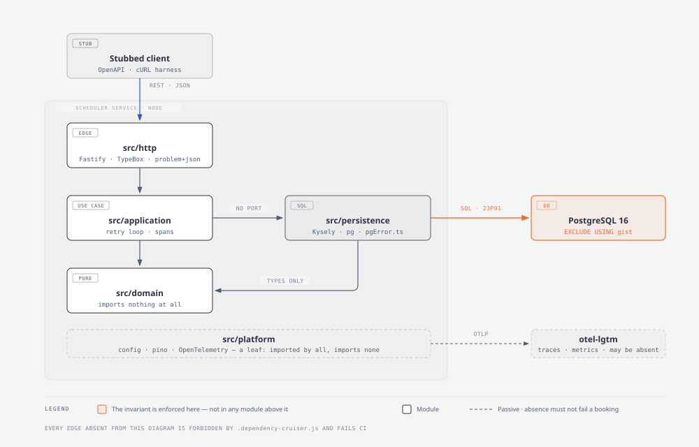

# 5. Building block view

> Owner: architect · Written: phase 2, corrected at each merge

The decomposition and the reasons for it are [ADR-0008](../adr/0008-module-decomposition.md). This section is what the decomposition *is*;
the ADR is why it beat the alternatives.

## 5.1 Level 1 — containers



*Source: [`diagrams/building-blocks.html`](../diagrams/building-blocks.html) · regenerate the SVG with `npm run diagram:export`*

| Container | Responsibility | Notes |
|---|---|---|
| **Stubbed client** | Not built. An OpenAPI document and a cURL harness stand in for it (TC-5) | The contract is *emitted* from the route schemas (ADR-0005), so it cannot drift from the service |
| **Scheduler service** | The whole system: validate, allocate, persist, report | One Node process. Five internal modules, §5.2 |
| **PostgreSQL** | The persistent store **and the enforcement point for the central invariant** | Not a generic persistence port. §2.1 forbids substituting it in any test that asserts a persistence invariant, and §4.1 explains why calling it swappable would be a lie |
| **Telemetry collector** | Receives OTLP traces and metrics; `pino` writes JSON to stdout | A local `grafana/otel-lgtm` container (§7). Its absence must not break the service |

There are no other neighbours, and §3.1.2 argues that omission rather than leaving it as one.

## 5.2 Level 2 — components

Whitebox of the scheduler service. Five modules, one permitted dependency direction, and a composition
root. The direction is enforced, not described: every forbidden edge below is a rule in
[`.dependency-cruiser.js`](../../.dependency-cruiser.js) and a CI failure (§5.3).

```
  src/http/         ──▶  src/application/  ──▶  src/domain/
                                │
                                └──────────▶  src/persistence/  ──▶  src/domain/  (types)

  src/platform/     a leaf: importable by http · application · persistence, imports nothing from src/
  src/main.ts       composition root: the only module permitted to see every layer
```

### `src/domain` — the policy core

Pure functions and types. **It imports nothing at all** — no other module, no npm package, no `node:`
builtin — and `dependency-cruiser`'s `domain-is-pure` rule enforces that absolutely, with no
allowlist. IANA-zone conversion uses the `Intl` global, which needs no import.

The purity is not aesthetic. GC-1 requires that the opening-hours rule *"must never acquire knowledge
of what is booked"*, because a validation rule that reads other bookings is an availability check and
reintroduces check-then-act. A module that cannot import a database client cannot consult one. The
prohibition stops being a promise and becomes a build failure.

| Module | Owns | The §1.4 ambiguity it absorbs |
|---|---|---|
| `interval.ts` | `appointmentInterval(startsAt, minutes)`, and **`occupancyInterval(interval)` — "the interval the constraint sees"** | **A-4.** Today `occupancyInterval` is the identity, which is the statement that there is no buffer. A buffer changes this function and the constraint's range expression, and nothing else |
| `duration.ts` | `serviceDuration(serviceType)` | **A-1.** If duration varies by vehicle this function gains a parameter; the interval arithmetic above it does not change, because it takes a number |
| `openingHours.ts` | `withinOpeningHours(interval, ianaZone, weeklyHours)` | **ADR-0001 / GC-1.** The only place in the system that reasons in wall-clock time (A-8). Breaks, holidays and one-off closures land here |
| `candidates.ts` | `orderCandidates(set, seed)`, `nextCandidate(set)`, `prune(set, resource, id)` | **A-10 / ADR-0009.** Ordering, the pruning rule and the attempt cap's arithmetic. Pure and seeded, so a failing interleaving is reproducible |
| `appointment.ts` | The status model: `confirmed`/`cancelled`, and which transitions are legal | **ADR-0003.** Cancellation is terminal and idempotent; only a confirmed appointment may be moved |

`occupancyInterval` deserves its name. A-4 is flagged in §1.4 as *"the assumption most likely to be
wrong in a real dealership"*, and the thing it moves is not the customer-facing appointment but the
span the exclusion constraint compares. Keeping those two ideas distinct while they happen to be
equal is the difference between a one-function change and an archaeology exercise.

### `src/application` — the use cases

`bookAppointment`, `rescheduleAppointment`, `cancelAppointment`, `readAppointment`,
`queryAvailability`. This layer owns the ADR-0004 retry loop, the span boundaries of §8.4, and
nothing else. It has no business rules of its own: every decision it makes is either delegated to
`domain` or adjudicated by the database.

Use cases return **discriminated unions, not exceptions**:

```ts
export type BookOutcome =
  | { kind: 'confirmed'; appointment: Appointment }
  | { kind: 'outside-opening-hours'; opens: string; closes: string }
  | { kind: 'unknown-reference'; reference: 'dealership' | 'vehicle' | 'customer' | 'service-type' }
  | { kind: 'vehicle-not-owned-by-customer' }
  | { kind: 'no-capacity'; resource: 'bay' | 'technician'; attempts: number };
```

so that §8.6's status mapping is an exhaustive `switch` the compiler checks. A new outcome cannot be
added without the HTTP layer failing to compile, which is the cheapest possible way to stop a domain
failure silently rendering as a `500`.

**This layer depends on `src/persistence` concretely. There is no repository port**, and that is a
decision rather than an omission — [ADR-0008](../adr/0008-module-decomposition.md) argues it at length. The short form: a port that can be
implemented in memory is a port whose implementation cannot hold this system's invariant, and offering
the socket invites the substitution `CLAUDE.md` §2.2 bans. The cost is that use cases are not
unit-testable without Docker, which is the correct outcome — the unit-testable surface is
`src/domain`, deliberately, and that is where the mutation budget is spent (§8.5).

### `src/persistence` — SQL, and the only place SQLSTATE is read

Kysely over `pg` (ADR-0006), plain `.sql` migrations (ADR-0007). `pg` and `kysely` are importable
here and nowhere else, so there is exactly one translation from a PostgreSQL error to a domain
outcome:

```ts
// src/persistence/pgError.ts — the single site
export type PgOutcome =
  | { kind: 'conflict'; resource: 'bay' | 'technician' }   // 23P01, from err.constraint
  | { kind: 'bad-reference'; constraint: string }          // 23503
  | { kind: 'other'; cause: unknown };
```

A second translation site is the classic way a `409` comes to mean two different things, and the way
`err.constraint` gets preserved on one path and dropped on another — which would break both the
`booking_conflicts_total{resource}` label and ADR-0009's pruning. The rule
`sql-only-in-persistence` makes adding one a CI failure.

| Module | Owns |
|---|---|
| `db.ts` | The Kysely instance and the `pg` pool |
| `schema.ts` | The `Database` interface, derived from the migrations |
| `pgError.ts` | SQLSTATE → `PgOutcome`, and the constraint-name → resource mapping |
| `appointmentRepository.ts` | The guarded `INSERT` (booking), the guarded atomic `UPDATE` (move, ADR-0003), the status `UPDATE` (cancel) |
| `candidateRepository.ts` | The **advisory** free-bay and free-qualified-technician read (A-3, A-9) |
| `referenceRepository.ts` | Dealership, its IANA zone and weekly opening hours; service type and its duration |
| `migrations/*.sql` | The schema, including the two exclusion constraints verbatim (§8.2) |

### `src/http` — the edge

Fastify, TypeBox schemas, RFC 9457 `application/problem+json`, and the OpenAPI emitter (ADR-0005).
It maps a use-case outcome to a status code and nothing more. It **may not import
`src/persistence`**: a route that queries directly would bypass the span boundaries and the retry
policy that make the booking path what it is.

### `src/platform` — the leaf

Config (including ADR-0009's attempt cap), the `pino` logger, the OpenTelemetry bootstrap and the
metric registry. Importable by everyone, imports nothing from `src/`. That shape is also exactly the
shape of a junk drawer; the leaf rule keeps it from acquiring behaviour, but only a reviewer keeps it
from acquiring *contents*.

### `src/main.ts` — the composition root

Reads config, starts telemetry, builds the pool, builds the server, listens. The only module allowed
to see every layer, and the only place a dependency is chosen rather than received.

## 5.3 Module dependency graph

**Generated, never hand-drawn** — a hand-drawn dependency graph is a claim, a generated one is a
fact:

```
npm run graph:modules      # Mermaid, from the real import graph
npm run lint:arch          # the same configuration, as a CI gate
```

The graph is rendered here from the first implementation slice onward; until `src/` exists there is
nothing to draw, and drawing the intended graph by hand would be exactly the claim this subsection
exists to avoid making.

`.dependency-cruiser.js` carries thirteen rules. Six describe the layering above; the rest are the
ones that do the real work:

| Rule | Forbids | Why it is not merely hygiene |
|---|---|---|
| `domain-is-pure` | `src/domain` → anything: any `src/` module, any npm package, any `node:` builtin | Makes GC-1 structural. The policy core cannot perform I/O, so it cannot consult the database |
| `sql-only-in-persistence` | `pg`, `kysely` outside `src/persistence` | One SQLSTATE translation site, so `409` cannot come to mean two things and `err.constraint` cannot be dropped on one path |
| `http-must-not-reach-persistence` | `src/http` → `src/persistence` | No route issues SQL; every database access carries a span and the retry policy |
| `http-framework-only-in-the-edge` | `fastify`, `@fastify/*`, `@sinclair/typebox` outside `src/http` (and `main.ts`) | A use case stays callable without a server |
| `outside-in-tests-do-not-import-src` | `tests/{acceptance,contract,property,concurrency}` → `src/` | OC-5 and METHODOLOGY P4 made structural. The path hook cannot catch this, because the file being written is one the test-engineer legitimately owns |
| `no-circular`, `platform-is-a-leaf`, `persistence-must-not-look-upward`, `application-must-not-reach-http`, `not-to-unresolvable`, `no-dev-dep-in-src` | the remaining edges and the usual hygiene | A cycle means two modules are one module with a false boundary, which makes every rule above unenforceable in principle |

The ruleset was verified to *fire*, not merely to parse, before it was committed: a fixture tree
breaking every rule reports each one by name, and a conforming tree shaped like this section reports
zero. QS-10 keeps that true.
