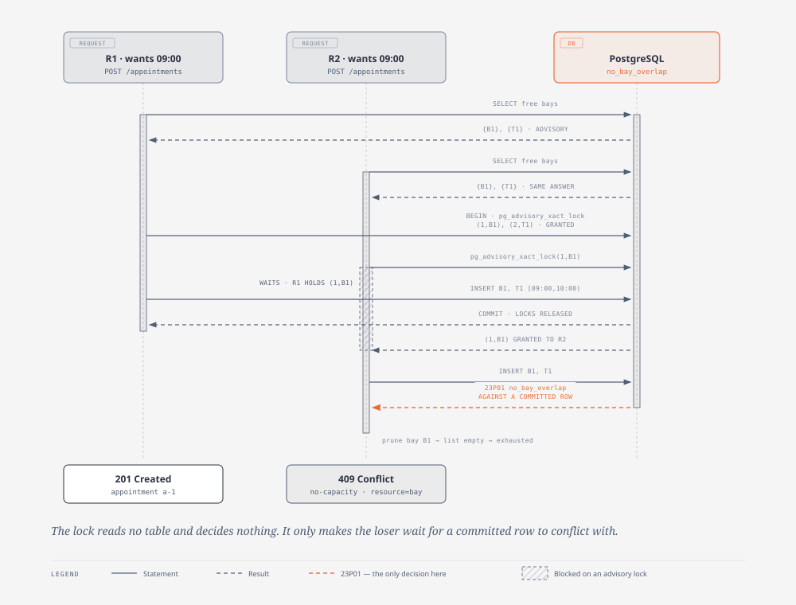

# 6. Runtime view

> Owner: architect · Written: phase 2

Five scenarios. The first is the one the whole design exists to make safe, so it is documented before
the happy path.

Two conventions hold throughout, and both are load-bearing:

- **Each write attempt is a single statement in autocommit.** A booking is one `INSERT` (A-6) and a
  move is one `UPDATE` (ADR-0003), so an attempt *is* its own transaction. ADR-0004's requirement
  that every attempt be independently recoverable is therefore satisfied by construction rather than
  by savepoint discipline — and the corresponding prohibition is absolute: **the retry loop must
  never be wrapped in a transaction**, or the second attempt fails with `25P02` (current transaction
  is aborted) instead of being retried. Nothing in `.dependency-cruiser.js` can catch that; QS-3
  does, immediately.
- **Reads before the loop are validation; reads inside it are advisory.** Opening hours and reference
  data are properties of the request, decided once (ADR-0001, ADR-0004). The candidate read is a
  suggestion about *which write to attempt next*, never about whether a write is allowed.

## 6.1 Concurrent booking — the database decides

**Mandatory scenario.** Two service advisors book the same service, at the same dealership, for the
same start, at the same instant. There is exactly one free bay.



*Source: [`diagrams/concurrent-booking.html`](../diagrams/concurrent-booking.html) · regenerate the SVG with `npm run diagram:export`*

```
R1                                  R2                        PostgreSQL
──                                  ──                        ──────────
POST /appointments                  POST /appointments
  ├ schema validation (TypeBox)       ├ schema validation
  ├ read dealership + service type    ├ read dealership + service type
  ├ withinOpeningHours()  ✓ pure      ├ withinOpeningHours()  ✓ pure
  │                                   │
  ├ span: availability.candidates     ├ span: availability.candidates
  │   SELECT free bays, free techs ───┼──────────────────────▶ {B1}, {T1}
  │   ◀── {B1}, {T1}                  │   ◀── {B1}, {T1}          ← BOTH see B1 free.
  │                                   │                            Advisory. Nothing is
  │                                   │                            concluded from it.
  ├ span: appointment.insert          ├ span: appointment.insert
  │   INSERT … B1, T1, [09:00,10:00) ─┼──────────────────────▶ exclusion check
  │                                   │                        ┌ no_bay_overlap: no
  │                                   │                        │ conflicting row
  │                                   │                        └ COMMIT ✓
  │   ◀── appointment a-1             │
  │                                   │   INSERT … B1, T1 ────▶ exclusion check
  │                                   │                        ┌ conflicts with a-1
  │                                   │                        └ ERROR 23P01
  │                                   │                          constraint =
  │                                   │                          "no_bay_overlap"
  │                                   │   ◀── 23P01
  │                                   ├ pgError.classify()
  │                                   │   → {conflict, resource:'bay'}
  │                                   ├ booking_conflicts_total{resource="bay",
  │                                   │                         outcome="absorbed"}++
  │                                   ├ prune bay B1 (ADR-0009)
  │                                   ├ candidate set now empty
  │                                   ├ booking_conflicts_total{…,outcome="refused"}++
  ▼                                   ▼
201 Created                         409 Conflict
{ appointment a-1 }                 problem+json, type=/problems/no-capacity,
                                    resource="bay"
```

**Where the race is actually decided.** Not in `withinOpeningHours`, which reads no booking. Not in
the candidate query, whose answer both requests believe and which is *wrong for one of them* the
moment it is returned. It is decided inside PostgreSQL's exclusion-constraint check, at the `INSERT`.

If the two statements are closer together than that diagram suggests — R2's `INSERT` arriving while
R1's is still uncommitted — R2 **blocks** on R1's in-progress row rather than being told anything, and
resumes when R1 ends: `23P01` if R1 committed, success if R1 rolled back. That blocking *is* the
serialisation point, it is the only one in the system, and it is where §11.2's write-throughput
ceiling comes from. It is also why no interleaving exists in which both succeed. There is no window,
because there is no check to have a window after.

**Where `23P01` is caught and mapped**, in one place per stage:

| Stage | Module | Result |
|---|---|---|
| raised | PostgreSQL | SQLSTATE `23P01`, `constraint = no_bay_overlap` \| `no_technician_overlap` |
| classified | `src/persistence/pgError.ts` — the **only** site (`sql-only-in-persistence`, §5.3) | `{ kind:'conflict', resource:'bay'\|'technician' }` |
| acted on | `src/application/bookAppointment.ts` | prune, count, retry or refuse (ADR-0004, ADR-0009) |
| rendered | `src/http` | `409` + `application/problem+json`, naming the contended resource (§1.3, §8.6) |

## 6.2 A booking that retries, and succeeds

The same path when the dealership still has capacity — the case ADR-0004 exists for, and the reason a
`409` means *the dealership was full* rather than *the allocator guessed badly*.

```
POST /appointments {customer, vehicle, serviceType, dealership, startsAt}
 │
 ├─ 1. schema validation ......................... fail → 400 (ADR-0005)
 ├─ 2. read dealership (zone, weekly hours) + service type
 │       not found ............................... → 422 (A-6)
 ├─ 3. duration  = serviceDuration(serviceType)              domain/duration.ts      (A-1)
 │     interval  = appointmentInterval(startsAt, duration)   domain/interval.ts
 │     occupancy = occupancyInterval(interval)               domain/interval.ts      (A-4)
 ├─ 4. withinOpeningHours(interval, zone, hours)             domain/openingHours.ts  (ADR-0001)
 │       outside ................................. → 400  ← decided with NO knowledge of
 │                                                           any booking, so no window
 ├─ 5. span availability.candidates
 │     freeResources(dealership, serviceType, occupancy) → bays[], technicians[]   ADVISORY
 │       empty ................................... → 409, no attempt made
 ├─ 6. orderCandidates(set, seed(requestId))                 domain/candidates.ts    (ADR-0009)
 │
 └─ 7. loop, attempt ≤ 16, OUTSIDE any transaction:
        ┌─────────────────────────────────────────────────────────────────┐
        │ (bay, tech) = nextCandidate(set)                                │
        │ span appointment.insert                                         │
        │   INSERT … VALUES (…, bay, tech, starts_at, ends_at,'confirmed')│
        │     ok      → 201 Created, appointment id, allocated bay+tech   │
        │     23P01   → classify → resource                               │
        │               booking_conflicts_total{resource,                 │
        │                                       outcome="absorbed"}++     │
        │               set = prune(set, resource, id)   ← the WHOLE bay  │
        │                                                  or technician  │
        │               continue                                          │
        │     23503   → 422 unknown reference (never retried)             │
        │     other   → rethrow → 500                                     │
        └─────────────────────────────────────────────────────────────────┘
        exhausted   → 409 {outcome="refused"}
        cap reached → 409 {outcome="capped"}   ← a different signal; if this is ever
                                                 non-zero in production the cap is wrong
```

Three details that a reviewer should check any implementation against:

- **Steps 2–4 run once.** The loop varies only the candidate; opening hours and reference integrity
  are properties of the request (ADR-0004).
- **`23503` is never retried.** A foreign-key violation means a bad reference (A-6), which is a client
  error and not contention. Swallowing it in the loop would turn a `422` into a `409` after sixteen
  pointless attempts.
- **The pruning uses `err.constraint`.** That is why ADR-0006 disqualified any query layer that wraps
  the driver error, and why the constraint *names* in the migration are behaviour rather than
  documentation (QS-1, QS-2 pin them).

## 6.3 Rescheduling — one atomic `UPDATE`

`PATCH /appointments/{id}` with a new `startsAt`. Steps 1–6 are §6.2's, with the appointment's own
dealership and service type read from the existing row; step 7 replaces the `INSERT` with:

```sql
UPDATE appointment
   SET bay_id = $2, technician_id = $3, starts_at = $4, ends_at = $5, updated_at = now()
 WHERE id = $1 AND status = 'confirmed'
RETURNING *;
```

**No `AND id <> $1` predicate anywhere, no pre-read of the target slot, no application-side
"is it free?" step** (ADR-0003). Four properties follow, and each is pinned by a scenario in §10
because none of them is obvious:

| Property | Why it holds | Pinned by |
|---|---|---|
| A refused move leaves the original **confirmed, at its original time** | The statement aborts. Nothing was released, so nothing must be restored — the atomicity is the statement's, not the application's | QS-4 |
| A move never transiently frees its slot | There is no committed intermediate state in which the row does not occupy the bay. A concurrent booking for the original slot is refused throughout | QS-5 |
| A move onto an interval overlapping its **own** current interval succeeds | PostgreSQL checks the new row version against *other* rows, not against the version it replaces. Extending a job by thirty minutes is an ordinary request | QS-6 |
| The appointment id survives | It is an `UPDATE`. A caller holding the id still holds it | QS-6 |

A move racing another move, or racing a fresh booking, is the §6.1 story with `UPDATE` in place of
`INSERT`. There is one mechanism, and rescheduling does not add a second. `0 rows` returned means the
appointment does not exist (`404`) or is not `confirmed` (`409`), distinguished by a follow-up read.

## 6.4 Cancellation

`POST /appointments/{id}/cancellation`:

```sql
UPDATE appointment SET status = 'cancelled', updated_at = now()
 WHERE id = $1 RETURNING *;
```

The row leaves the exclusion constraints' scope through their `WHERE (status <> 'cancelled')`
predicate, so the slot becomes bookable again **by the same mechanism that guards every other write**
— no bookkeeping, no compensating release, nothing to get wrong. Cancelling an already-cancelled
appointment is idempotent and returns `200` (ADR-0003). QS-7 exercises the predicate, which would
otherwise be a clause no test ever reaches.

## 6.5 Availability query — advisory by contract

`GET /availability?dealershipId&serviceTypeId&from&to` runs `candidateRepository.freeResources` over
a window and returns free bays and qualified free technicians. It takes no lock, reserves nothing,
and its answer may be stale before the response is serialised. **The response body says so**, and the
OpenAPI description says so, because that staleness is a property of the domain interface and not an
implementation detail (§3.1, §4.1).

The overlap predicate is the same expression the exclusion constraint uses:

```sql
tstzrange(a.starts_at, a.ends_at) && tstzrange($from, $to)   AND a.status <> 'cancelled'
```

Those two expressions live in two files and nothing forces them to agree — §4.2 explains why a shared
`IMMUTABLE` SQL function is a trap rather than a fix. QS-8 is what holds them together: under
quiescence, anything availability reports free must be insertable, and anything it reports busy must
be refused.

The partial GiST indexes created by the exclusion constraints serve this query's range predicate, so
the mechanism that costs write throughput (§11.2) pays for the read path.

## 6.6 Where each failure is decided

One row per failure, and the column that matters is the third: how much of the world had to be
consulted.

| Failure | Decided by | Reads | Status |
|---|---|---|---|
| Malformed body, bad timestamp | TypeBox schema, `src/http` | nothing | `400` |
| Outside opening hours | `domain/openingHours.ts` | reference data only — **never a booking** (GC-1) | `400` |
| Unknown dealership, service type, customer or vehicle | reference read, then the FK (`23503`) | reference data | `422` |
| Vehicle not owned by the named customer | composite FK (`23503`) | reference data | `422` |
| Unknown appointment id | the `UPDATE`'s `0 rows` | one row | `404` |
| Appointment not `confirmed` | the `UPDATE`'s `0 rows` | one row | `409` |
| Every candidate refused | **PostgreSQL, `23P01`, repeatedly** | the whole live schedule, as a side effect of writing | `409` |

The last row is the only one whose answer depends on what else is happening at that instant, and it
is the only one the application does not decide.
