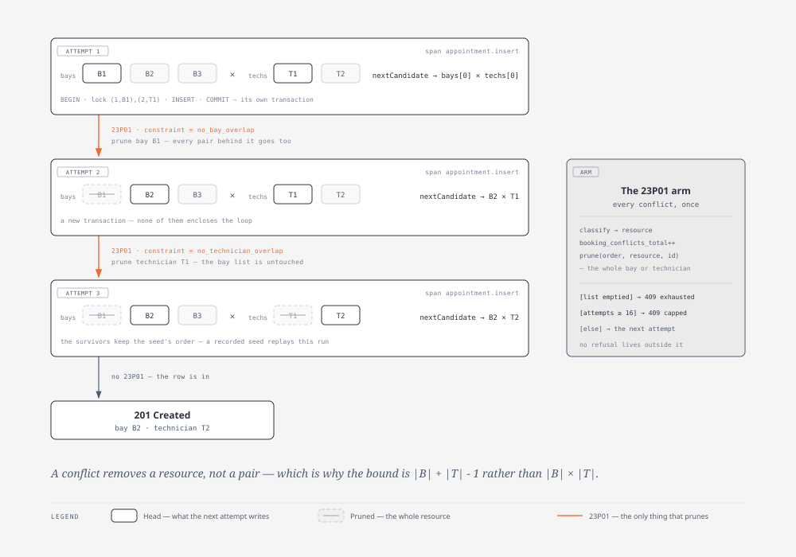
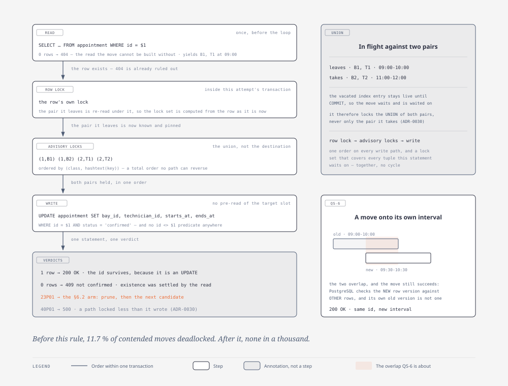
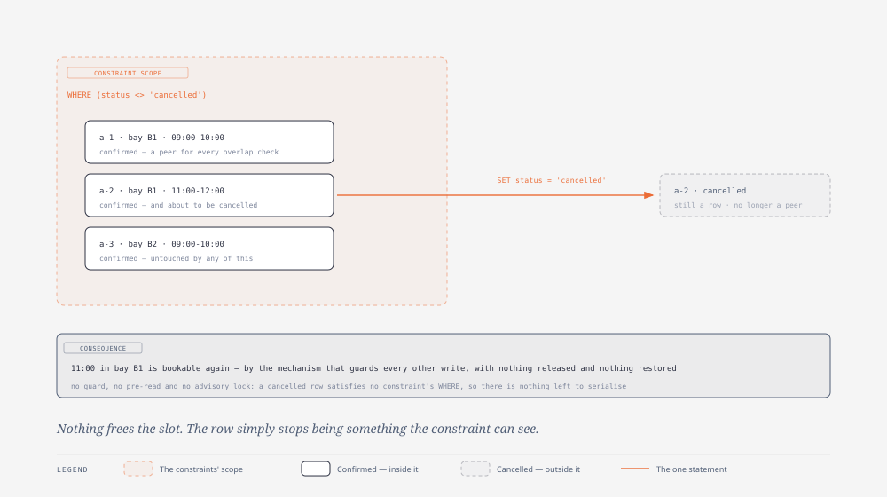
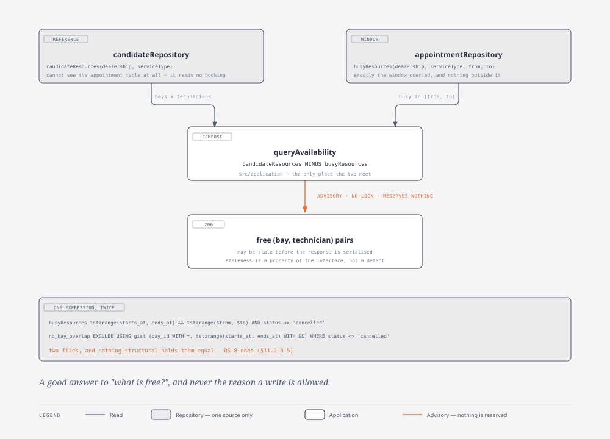

# 6. Runtime view

> Owner: architect · Written: phase 2

The data flow, in five scenarios. The first is the one the whole design exists to make safe, so it is
documented before the happy path.

Two conventions hold throughout. **Each attempt is exactly one transaction wide** — two advisory locks,
then the one `INSERT` or `UPDATE` — so every attempt is independently recoverable, and **no transaction
may enclose the loop** (QS-3 catches it immediately). And **reads before the loop are validation; reads
inside it are advisory**: the candidate read only suggests *which write to attempt next*, never whether a
write is allowed. **Every figure below is generated from the `.html` beside it** — regenerate with
`npm run diagram:export`.

## 6.1 Concurrent booking — the database decides

**Mandatory scenario.** Two users book the same service, dealership and start at the same instant. There
is exactly one free bay.


*Source: [`concurrent-booking.html`](../diagrams/concurrent-booking.html)*

**Where the race is actually decided.** Not in `withinOpeningHours`, which reads no booking. Not in the
candidate query, whose answer both requests believe and which is *wrong for one of them* the moment it is
returned. Not in the advisory lock, which reads no table. It is decided inside PostgreSQL's
exclusion-constraint check, at the `INSERT`. **There is no window, because there is no check to have a
window after.**

**Why the lock is there, and why it is not part of that.** Without it, simultaneous inserters do not
queue: `check_exclusion_constraint` inserts the index tuple and *then* scans, so each waits on the others'
in-progress tuples and they cycle. The invariant was never in question; the *status* was — a deadlock
carries no constraint, so no verdict to render as `409`. The two locks the figure draws buy that verdict
and nothing else ([ADR-0018](../adr/0018-lock-the-bay-and-the-technician-before-each-insert.md)).

**The lock decides nothing, and that is measured both ways** in
`tests/integration/exclusion-constraint-adjudicates.test.ts`. Drop the lock, keep the constraints: still
exactly one row, with 108 deadlocks. Drop the constraints and **hold** the locks: twenty overlapping rows
land one at a time, zero refusals. *The lock buys liveness; only the constraint makes overlap
unrepresentable.*

`23P01` is raised by PostgreSQL, classified in `src/persistence/pgError.ts` — the only site — acted on in
`src/application/attemptLoop.ts` and rendered by `src/http` as a `409` naming the resource. A `40P01` is
**not retried**: a write locks every resource it is in flight against (ADR-0030), so a deadlock means a
path locked less than it wrote — an internal fault rendering `500`.

## 6.2 A booking that retries, and succeeds

The same path when the dealership still has capacity — the reason a `409` means *the dealership was full*
rather than *the allocator guessed badly*.



*Source: [`candidate-pruning.html`](../diagrams/candidate-pruning.html)*

```
POST /appointments {customer, vehicle, serviceType, dealership, startsAt}
 │
 ├─ 1. schema validation ......................... fail → 400
 ├─ 2. read dealership (zone, weekly hours) + service type
 │       not found ............................... → 422 (A-6)
 ├─ 3. duration  = serviceDuration(serviceType)              domain/duration.ts    (A-1)
 │     interval  = appointmentInterval(startsAt, duration)   domain/interval.ts
 │     occupancy = occupancyInterval(interval)               domain/interval.ts    (A-4)
 ├─ 4. withinOpeningHours(interval, zone, hours)             domain/openingHours.ts
 │       outside ................................. → 400  ← decided with NO knowledge of
 │                                                           any booking, so no window
 ├─ 5. span availability.candidates
 │     candidateResources(dealership, serviceType) → bays[], technicians[]   ADVISORY
 ├─ 6. orderCandidates(bays, technicians, deps.seed())       domain/candidates.ts
 │        seeded, pure, injected — never a global RNG
 │        null → THE ONLY empty-candidate branch, and it is REACHABLE:
 │             no bay ........................ → 500  ┐ two different failures, and
 │             no qualified technician ....... → 422  ┘ NEVER a fabricated 409 — there
 │                                                      is no verdict to build one from
 │
 └─ 7. for attempts = 1 .. |bays| + |technicians|      ← the structural bound
        ONE transaction per attempt, NONE around the loop:
        ┌─────────────────────────────────────────────────────────────────┐
        │ (bay, tech) = nextCandidate(set)                                │
        │ span appointment.insert                                         │
        │   INSERT … VALUES (…, bay, tech, starts_at, ends_at,'confirmed')│
        │     ok      → 201 Created, appointment id, allocated bay+tech   │
        │     23P01   → classify → resource      ← MINTED here, ADR-0016  │
        │               booking_conflicts_total{resource,absorbed}++      │
        │               set = prune(set, resource, id)   ← the WHOLE bay  │
        │                                                  or technician  │
        │               list emptied  → 409 exit="exhausted"   ┐ BOTH     │
        │               attempts ≥ cap → 409 exit="capped"     ┘ EXITS    │
        │               else            continue         ARE IN THIS ARM  │
        │     23503   → 422 unknown reference (never retried)             │
        │     other   → rethrow → 500                                     │
        └─────────────────────────────────────────────────────────────────┘
        The tail is unreachable and tightly so: each conflict prunes exactly one id while
        both lists are non-empty, so the deepest reachable attempt is exactly |B|+|T|-1,
        a bound an adversary attains. It THROWS rather than refusing — nothing is minted
        there. Proven by exhaustive search over every adversarial path, (B,T) in 1..9².
```

Three details to check any implementation against. **Steps 2–4 and step 6 run once**, and the
empty-candidate answers live in step 6's `null` branch rather than in front of it, so every branch here is
reachable. **`23503` is never retried**: a bad reference is a client error, and swallowing it in the loop
turns a `422` into a `409` after sixteen pointless attempts. **Pruning uses `err.constraint`** — why
ADR-0006 disqualified any query layer that wraps the driver error (§11.2 R-3).

Both refusals carry the resource this arm's own classification minted, the cap tested **inside** the
`23P01` arm and never as the loop's bound, so no refusal exit is reachable without a database verdict.
Because the bound is exact, `capped` is reachable only where |bays| + |technicians| ≥ 18 — and at §1.1
scale it is, so a non-zero `capped` is expected today (§11.2 R-4).

## 6.3 Rescheduling — one atomic `UPDATE`

`PATCH /appointments/{id}` with a new `startsAt`. Steps 1–6 are §6.2's, with the appointment's own
dealership and service type read from the existing row — **and that read also decides `404`**, being one
the move cannot be built without. Step 7 replaces the `INSERT`, and **attempt 1 is the pair the row
already holds** before the shuffle opens:

```sql
UPDATE appointment
   SET bay_id = $2, technician_id = $3, starts_at = $4, ends_at = $5, updated_at = now()
 WHERE id = $1 AND status = 'confirmed'
RETURNING <the ten columns>;   -- as built: named, never `*`
```



*Source: [`reschedule-lock-union.html`](../diagrams/reschedule-lock-union.html)*

**No `AND id <> $1` predicate anywhere, no pre-read of the target slot, no application-side "is it free?"
step.** Four properties follow, none obvious, each pinned in §10: a refused move leaves the original
**confirmed at its original time**, the statement having aborted, so nothing was released and nothing must
be restored (QS-4); a move never transiently frees its slot (QS-5); a move onto an interval overlapping its
**own** succeeds, PostgreSQL checking the new row version against *other* rows (QS-6); and the id survives,
because it is an `UPDATE`.

**A move is in flight against two pairs, not one.** Its vacated index entry stays live until commit, so it
both waits and is waited on, and it therefore locks the **union** of both — row lock, advisory locks,
write, ordered by `(class, hashtext(key))` over a lock set covering every tuple wait, which is what keeps
that acyclic (ADR-0030). Measured: **11.7 % of contended moves deadlocked before this rule, 0 / 1000
after.** `0 rows` then means one thing — not `confirmed` — existence having been settled by the read above.

## 6.4 Cancellation

`POST /appointments/{id}/cancellation` — one unconditional statement: no guard, no pre-read and **no
advisory lock**.

```sql
UPDATE appointment
   SET status = 'cancelled',
       updated_at = CASE WHEN status = 'cancelled' THEN updated_at ELSE now() END
 WHERE id = $1
RETURNING …;
```



*Source: [`cancellation-scope.html`](../diagrams/cancellation-scope.html)*

The row leaves the constraints' scope through their `WHERE (status <> 'cancelled')` predicate, so the
slot becomes bookable again **by the same mechanism that guards every other write** — no bookkeeping, no
compensating release. Zero rows then means one thing only, *no such id*, where a guarded
`AND status <> 'cancelled'` would return zero for a replay too. The `CASE` is what makes the idempotent
`200` change **no column**, asserted as `to_jsonb` equality — though `xmin` advances, so *changes nothing*
is true where *writes nothing* is not.

## 6.5 Availability query — advisory by contract

`GET /availability?dealershipId&serviceTypeId&startsAt` is **two reads composed in
`src/application/queryAvailability.ts`**: `candidateResources` (reference data) minus
`appointmentRepository.busyResources` (the window); `candidateRepository.ts` cannot see `appointment` at
all. It takes no lock and reserves nothing, and its staleness is a property of the domain interface rather
than an implementation detail.

**The caller states a start and the server derives the window**, by calling `deriveInterval` — the
function `bookAppointment` calls, unedited — so duration arithmetic keeps one home and the
opening-hours gate cannot be left behind ([ADR-0039](../adr/0039-availability-takes-a-start-not-a-window.md)).
The `200` **names the interval it answered about**. That is what makes the reuse checkable rather
than merely claimed: the two endpoints can be required to return the same two instants for one
`(dealership, service type, start)`, and QS-8 can probe the interval the response named instead of
recomputing one.

**Two intervals, one value today.** `deriveInterval` yields both, and they are not the same concept:
the busy read is issued over the **occupancy** interval — what the exclusion constraint sees — while
the response names the **appointment** interval the client asked about. `A-4` holds the buffer at
zero, so the two are currently the same value, and `occupancyInterval` (`src/domain/interval.ts`) is
the single site a non-zero buffer would change. The distinction is consequently **asserted by no
test, and deliberately so**: while the values are equal a test could only assert `x === x` and would
have failed at no point in its life, which §2.4 does not accept as evidence. Its reader is whoever
introduces a buffer, and this paragraph — not the code comment that cites it — is the record.



*Source: [`availability-composition.html`](../diagrams/availability-composition.html) — **the drawing
still shows the retired `from`/`to` signature**; presentation diagrams are redrawn once, in phase 6
(§11.1 `D-16-2`).*

The overlap predicate is the same expression the exclusion constraint uses:

```sql
tstzrange(starts_at, ends_at) && tstzrange($occupancyStartsAt, $occupancyEndsAt)
  AND status <> 'cancelled'
  AND dealership_id = $1      -- redundant by the composite FKs; it scopes the index, not the answer
```

Two expressions in two files with nothing structural holding them equal (§11.2 R-5). QS-8 is what holds
them together — over the interval the response names, never one the test recomputes — and the partial
GiST indexes serve this query's range predicate.

## 6.6 Where each failure is decided

The column that matters is the third: how much of the world had to be consulted.

| Failure | Decided by | Reads | Status |
|---|---|---|---|
| Malformed body, bad timestamp | TypeBox schema, `src/http` | nothing | `400` |
| Outside opening hours | `domain/openingHours.ts` | reference data only — **never a booking** | `400` |
| Unknown dealership, service type, customer or vehicle | reference read, then the FK (`23503`) | reference data | `422` |
| Vehicle not owned by the named customer | composite FK (`23503`) | reference data | `422` |
| Unknown appointment id | the read the move needs anyway | one row | `404` |
| Appointment not `confirmed` | the guarded `UPDATE`'s `0 rows` | one row | `409` |
| Unmatched route | `setNotFoundHandler` | nothing | `404` |
| Every candidate refused | **PostgreSQL, `23P01`, repeatedly** | the whole live schedule, as a side effect of writing | `409` |

The last row is the only one whose answer depends on what else is happening at that instant, and the only
one the application does not decide.
