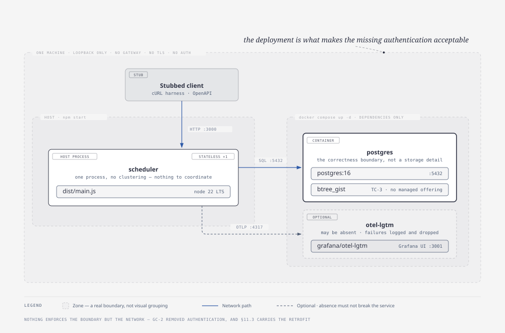

# 7. Deployment view

> Owner: architect · Written: phase 2

**Deliberately minimal.** Two containers and a host process on one machine, plus one pipeline; §11.3
names what production would additionally require, rather than inventing it.

## 7.1 The runtime environment



*Source: [`deployment.html`](../diagrams/deployment.html) · regenerate with `npm run diagram:export`*

The **scheduler** is one stateless process: everything holding across requests holds in PostgreSQL, so a
second instance would need no coordination — and no reason to exist. **postgres** is the correctness
boundary rather than a storage detail: its `btree_gist` requirement (TC-3) rules out any managed offering
that restricts extensions. **otel-lgtm** carries Grafana, Tempo, Loki and Prometheus in one container
over OTLP/gRPC, and **its absence must not break the service**. The service is deliberately **not** in
compose, as `docker-compose.yml`'s own header says, so the two cannot drift.

Versions are pinned because TC-10 left them open: **PostgreSQL 16** in compose *and* in the
Testcontainers image tag, and `"node": ">=22.22.0 <23 || >=24.0.0 <25"` in `package.json` `engines` —
the disjunction being load-bearing, since a naive `>=22.11 <25` admits both 22.11–22.21, which fails
`npm ci --engine-strict`, and 23.x, which `vitest` and `dependency-cruiser` exclude.

**No gateway, no TLS, no load balancer, and unsafe to expose on any reachable network**, GC-2 having
removed authentication — acceptable *only* because of this deployment, which is why the two
are stated together. §11.3 carries the retrofit.

## 7.2 Under test — Testcontainers stands in for PostgreSQL

No SQLite, no in-memory repository, no mocked database in any test asserting a persistence invariant
(§2.1): the invariant lives in the database, and any substitute's imitation would be check-then-act.

```
vitest globalSetup
  └── PostgreSqlContainer('postgres:16')        one container per test RUN
        └── node-pg-migrate, programmatic       the same migrations as production
              └── DATABASE_URL exported to every worker
```

**The schema under test is the schema that runs**, asserted by `pgmigrations` recording exactly
`0001_extensions`, `0002_reference_data`, `0003_appointment` in filename order. **Tests isolate by data,
not by truncation** — each seeds its own dealership, keeping A-9's scoping under permanent test and
stopping the concurrency tests racing a cleanup instead of each other. **Concurrency tests get real
connections**: QS-1 to QS-5 fire genuinely simultaneous statements over several pooled connections.

The cost is TC-9, so Vitest runs two projects split by *what a test needs*: `nodb` (`tests/unit/**`,
`tests/architecture/**` and every `tests/property/**` file that is not `*.db.test.ts`) with no
`globalSetup`, and `db` for everything that talks to PostgreSQL; `npm run test:nodb` is the Docker-less
command. **`npm test` is not `vitest run`** but
[`tools/ci/run-tests.mjs`](../../tools/ci/run-tests.mjs), which runs the two as separate invocations,
because a single run aborts on a container failure and discards the `nodb` results, after which
red-proof reads `failedFiles: []` as *"no suite failed"*. Its rule: **a project that did not run is a
loud, distinct failure, never an empty contribution** — `EXIT_DID_NOT_RUN = 2`, where
`EXIT_TESTS_FAILED` is 1. A soft-failing `globalSetup` was rejected as a green over nothing.

## 7.3 Configuration

Environment variables only, validated at startup — a missing or malformed value fails the process rather
than surfacing as a request error at 03:00. `src/platform/config.ts` is the only reader — including
`OTEL_SERVICE_NAME`, deliberately, since the SDK's own `envDetector` would leave an operator who forgets
it on `unknown_service:node` — leaving `OTEL_EXPORTER_OTLP_ENDPOINT` as the sole name the OpenTelemetry
SDK auto-configures.

| Variable | Purpose |
|---|---|
| `DATABASE_URL` | PostgreSQL connection string |
| `PORT` | HTTP listener |
| `LOG_LEVEL` | `pino` level |
| `OTEL_EXPORTER_OTLP_ENDPOINT` | Collector; unset disables export without disabling instrumentation |
| `OTEL_SERVICE_NAME` | Resource `service.name` on all three signals; optional, default `keyloop-service-scheduler` — the artifact names itself, so the variable is a rename rather than a prerequisite |
| `BOOKING_ATTEMPT_CAP` | ADR-0009's cap, default 16 |
| `BOOKING_SEED` | ADR-0009's ordering seed, overridable so a failing interleaving is re-runnable; unset in production, and set it warns at the default `LOG_LEVEL` |
| `DB_POOL_MAX` | Pool ceiling, default 10 — dictated by the concurrency test rather than copied from `pg`'s default |

**This table is the contract, and `BOOKING_` marks what this application invented**, an unprefixed name
being one something else fixed. There are no secrets: nothing to authenticate to (GC-2).

## 7.4 The pipeline

**GitHub Actions on `ubuntu-latest`**
([ADR-0010](../adr/0010-github-actions-and-check-run-collection.md)), in
[`.github/workflows/verify.yml`](../../.github/workflows/verify.yml). **The runner is a correctness
prerequisite, not a convenience**: TC-9 requires Docker and §2.1 forbids substituting the database, so a
runner without a daemon runs only the tests that would pass anyway. Testcontainers starts its own
`postgres:16`, so the pipeline needs no `services:` block. Three jobs — `verify` (docs, tooling, `typecheck`,
`lint:arch`), `test` and `red-proof` — split by *does it need `src/`*, so `npm test` runs from the red
commit onward: §2.1 requires every slice's failing acceptance test to be **observed red in CI**, and a
suite bundled behind the application would mean a red that never ran there. `red-proof` succeeds when
that failure was observed and is armed only by a commit subject matching `test(…): … (red)`, so it
cannot be self-awarded. The runner is pinned to Node **22.x** though §7.1's range admits 24, so CI
agrees with production; **QS-14's budget is stated *"on the CI container"***, so changing runner class
silently changes what that scenario asserts; and the pipeline holds `contents: read` only, so nothing in
CI can write to the repository whose git history is itself an assessed artifact.
