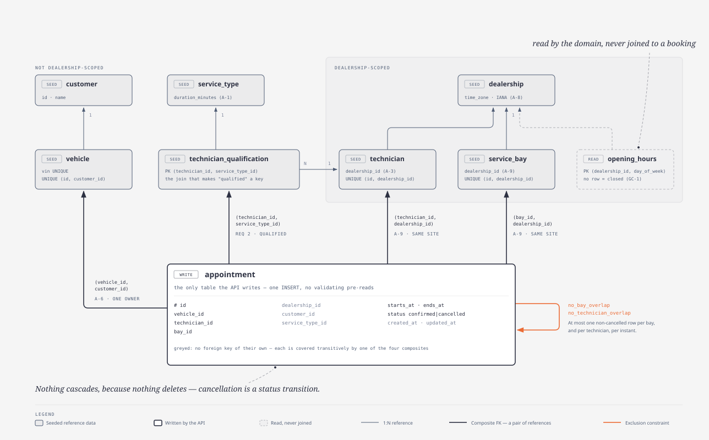
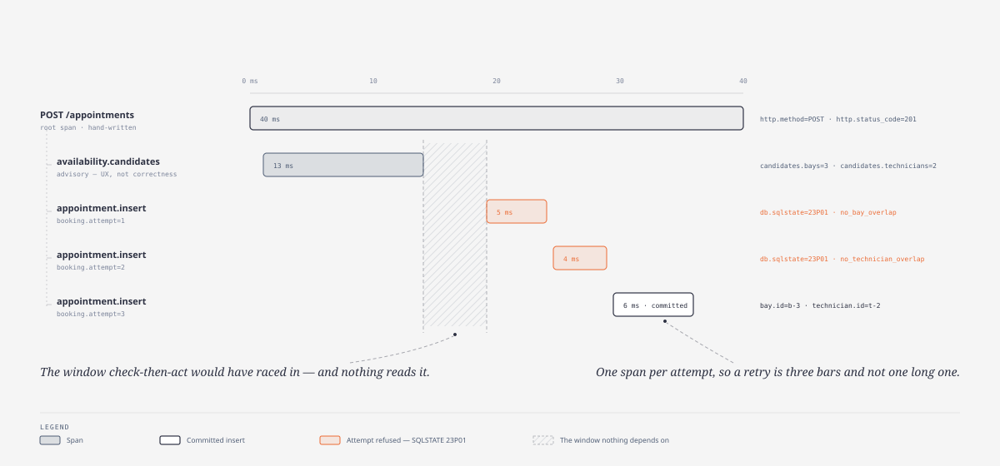

# 8. Cross-cutting concepts

> Owner: architect · Written: phase 2, extended per slice

## 8.1 Domain model

Nine relations. Eight arrive by migration and fixture (A-6, A-7); `appointment` is the only one the API
writes. The `CREATE TABLE` text lives once, in `src/persistence/migrations/0002`–`0003`; arc42 carries the
model and the reasoning.



*Source: [`domain-model.html`](../diagrams/domain-model.html) · regenerate with `npm run diagram:export`*

| Relation | The line worth writing down |
|---|---|
| `dealership` | A site and its IANA `time_zone` (§8.3) |
| `opening_hours` | `(dealership_id, day_of_week)`, local `time` bounds. **A day with no row is a day the site is closed** — the absence is the datum |
| `service_type` | The catalogue, carrying `duration_minutes` (A-1). **Not dealership-scoped**: one catalogue, every site |
| `service_bay` · `technician` | The two contended resources, scoped by `dealership_id` (A-3, A-9). `UNIQUE (id, dealership_id)` is not redundant beside the primary key — it is the *target* a composite foreign key needs |
| `customer` · `vehicle` | `vehicle` carries its owner and a `UNIQUE (id, customer_id)` for the same reason. **Neither is dealership-scoped**: a customer is not a site's property |
| `appointment` | The booking and its interval. Seven named constraints, and exactly seven |

**The brief's requirement 2 has two halves, and neither is left to application care.** *"A qualified
Technician"* is a composite foreign key from `appointment (technician_id, service_type_id)` to
`technician_qualification`; *"available… for the entire service duration"* is §8.2's exclusion constraint.
The same trick carries A-9 and A-6, so booking stays the **single `INSERT`** A-6 depends on.

**`dealership_id`, `service_type_id` and `customer_id` carry no foreign key of their own, and that is
complete rather than missing** — they are covered *transitively*, and adding the singletons would be
**harmful**: with two constraints violable at once, which one PostgreSQL reports is trigger order, and
§8.6 maps `422` *by constraint name*. And nothing cascades, because nothing deletes — cancellation is a
status transition.

## 8.2 Persistence and the exclusion constraint

Requirement 2's second half, and the reason this system exists. Reproduced **verbatim**, because
paraphrasing the one thing that must be exactly right is how it stops being so:

```sql
ALTER TABLE appointment ADD CONSTRAINT no_bay_overlap
  EXCLUDE USING gist (bay_id WITH =, tstzrange(starts_at, ends_at) WITH &&)
  WHERE (status <> 'cancelled');

ALTER TABLE appointment ADD CONSTRAINT no_technician_overlap
  EXCLUDE USING gist (technician_id WITH =, tstzrange(starts_at, ends_at) WITH &&)
  WHERE (status <> 'cancelled');
```

Six consequences, each of which something elsewhere depends on:

1. **`tstzrange` is half-open, `[starts_at, ends_at)`**, so back-to-back appointments in one bay are
   legal. That *is* A-4 — no buffer — expressed as a bound.
2. **The predicate makes the index partial**, so cancelling frees the slot through the same mechanism
   that guards every write and no compensating release exists to be forgotten.
3. **The constraint names are behaviour, not documentation**: `err.constraint` is what the retry loop
   prunes on and what labels `booking_conflicts_total{resource}`. QS-1 and QS-2 pin them (§11.2 R-3).
4. **An `UPDATE` is checked against other rows, not against the version it replaces — and it is the
   *index* that never sees the superseded version, not a rule anyone wrote.** That is what makes the
   atomic move work, and the mechanism is the load-bearing half: `EXCLUDE USING gist` writes a new tuple,
   marks the old one dead, and compares only against *live* entries. The same outcome from a
   `BEFORE UPDATE` trigger would be check-then-act with the check moved inside the database, correct only
   while someone remembers `AND o.id <> NEW.id`. QS-6 asserts the outcome; slice 06's design measures the
   mechanism.
5. **`btree_gist` is required** (TC-3): `bay_id WITH =` is an equality operator on a `uuid`, which plain
   GiST cannot index — §7.1's deployment constraint.
6. **The indexes serve the availability query too** (§6.5), so the mechanism that costs write throughput
   pays for the read path.

**The one thing this does not give for free** is agreement between the constraint's range expression and
the availability query's — two expressions in two files, with QS-8 and not the type system holding them
equal (§4.2, §11.2 R-5).

## 8.3 Time, zones and the calendar

A-8 makes the boundary and the storage **instants**; ADR-0001 then validates opening hours, stated in
wall-clock time. One rule reconciles them:

> **The dealership's zone is used for opening-hours validation and for nothing else. It never enters an
> overlap calculation.**

The wire carries RFC 3339 with an offset, storage is `timestamptz`, overlap is `tstzrange` on the
absolute timeline, opening hours are `time` + `day_of_week` beside an IANA zone, and duration is
**absolute minutes**. **The conversion runs one way only: instant → local wall clock** — total and
single-valued, where the reverse has no answer at a spring-forward and two at a fall-back. Two
consequences look like bugs and are not: a 60-minute job can end two local hours after it starts, and the
bookable window shifts by an hour twice a year. QS-9 carries the measurements.

`withinOpeningHours` runs six steps in a fixed order, and **the order is asserted**, a mutant that
reorders them being otherwise unkillable: endpoints integral, bounded and `end > start`
(`malformed-interval`) → the zone constructs a formatter (`unknown-zone`) → render both endpoints → same
local date (`spans-local-days`) → that weekday has a row (`closed-day`) → the times parse and
`opens ≤ start`, `end ≤ closes` (`malformed-hours` / `outside-window`). Every step fails closed: a gate
that cannot read its own configuration refuses rather than guesses.

Two results read as defects and are not. `2026-10-25T00:30:00Z` and
`2026-10-25T01:30:00Z` both render `01:30` on the fall-back night and get the **same** verdict, **which
is correct**: the doors are in the same state both times round, and the ambiguity belongs to
*local → instant*, which this rule never performs. And there is one exception to the same-day rule — an
end rendering `00:00:00` on the day after the start's normalises to `secondsOfDay = 86400`, so a job
finishing at closing midnight is bookable while a genuine crossing (23:00 to 01:00) stays rejected.

## 8.4 Observability

**The strategy: every question an operator has to answer in production is answered from a signal this
system already emits — including the one that matters most, whether the double-booking invariant is
holding.** Three routine operational questions drive it, and this section ends with the signal each is
answered from. §1.2 goal 4 adds a fourth peculiar to this architecture: **the check-then-act window the
code never relies on is visible in a waterfall**, so the reason double-booking cannot happen is
observable in production rather than only in tests.

TC-8 fixes the tooling: OpenTelemetry for traces and metrics, `pino` for logs, exported over OTLP to
§7.1's collector.

### Traces

The figure is the contract; the bullets name what it cannot show.



*Source: [`booking-trace.html`](../diagrams/booking-trace.html) · regenerate with `npm run diagram:export`*

- **The root span `{METHOD} {path}` is hand-written, not auto-instrumented.** A `serverFactory` wraps the
  raw handler so the span opens *before* Fastify builds its request. It carries `http.method`,
  `http.target` and `http.status_code`. Why auto-instrumentation could not do this is §11.1 D-09-3.
- **`availability.candidates` is a separate span from the insert, deliberately.** The gap between its end
  and the next span's start *is* the window check-then-act would have raced in — drawn so a reader can
  see nothing depends on it. Attributes: `candidates.bays`, `candidates.technicians`.
- **`appointment.insert` is one span per attempt**, so a retried booking's waterfall shows the retries
  rather than one long bar. Each carries `booking.attempt`, `bay.id`, `technician.id`, and on failure
  `db.sqlstate` and `db.constraint` — naming which resource refused it.
- **A move and a cancellation have the same shape**: `appointment.update` over the same attempt loop,
  and `appointment.cancel`.

### Metrics

| Metric | Type | Labels | Notes |
|---|---|---|---|
| `booking_conflicts_total` | counter | `resource` ∈ {bay, technician}, `outcome` ∈ {absorbed, refused, capped} | **The invariant, made observable.** `absorbed` = retried successfully, `refused` = candidates exhausted, `capped` = the attempt cap hit — three outcomes and not one, because conflating them hides contention behind failure. A non-zero `capped` is expected today (§11.2 R-4) |
| `appointments_booked_total` | counter | `dealership` | |
| `appointments_rescheduled_total` | counter | `outcome` ∈ {moved, refused} | A move refused for *state* increments neither — §8.6's two `409`s |
| `appointments_cancelled_total` | counter | | |
| `booking_attempts` | histogram | | Attempts per request, at the loop's exit whatever the outcome. Its tail is ADR-0009's ordering working or not |

Two rules keep the conflict counter trustworthy, and both are asserted rather than intended.

- **Incremented on SQLSTATE `23P01` and on nothing else** — never on an HTTP status code, so a change to
  §8.6's taxonomy cannot move it.
- **Incremented from exactly one module**, `src/application/attemptLoop.ts`, at most once per loop.
  Without that clause, `pg` auto-instrumentation, a repository span and a use-case span would count one
  conflict three times. A QS-12 marker holds the file set by equality.

### Logs

`pino` JSON to stdout **and, on the same call, to the collector over OTLP**: one line per request, plus
one per attempt. `pino.multistream` composes the two, so the bridge is added alongside stdout, never
instead of it.

- **The record carries the real trace context**, read from the span active on the emitting stack as the
  record is built — not parsed back out of the line's text, which would be a correlation id of its own.
  That is why Loki and Tempo join, and why the bridge is in-process rather than an auto-instrumentation
  or a worker-thread transport ([ADR-0037](../adr/0037-bridge-pino-to-opentelemetry-in-process.md); the
  measurement is §11.1 `D-09-3`). The line's own `trace_id`/`span_id` fields remain, for a reader of
  stdout.
- **Identifiers only, never names**, on the record's attributes as on the line. A line names
  `customer.id`, not the customer, so nothing is logged that GDPR-grade handling would have to cover.
- **An export failure is dropped, never raised.** A collector outage must not fail a booking: the
  bridge's `write()` swallows its own failures and a batch processor queues rather than blocks.

### What an operator does with this

The three questions of §1.2, and the signal each is answered from.

| Question | Signal | The answer |
|---|---|---|
| *Is it up?* | `/health`, and the root span's `http.status_code` | Binary |
| *Is contention rising, or is something broken?* | `booking_conflicts_total` by `outcome` | `absorbed` climbing alongside `appointments_booked_total` is a busy Saturday. `refused` or `capped` climbing is **capacity** — answerable by adding a bay rather than by reading code. A `5xx` rate against a **flat** conflict counter is a fault, and the flatness is the evidence: the counter sees `23P01` and nothing else |
| *Why did this one fail?* | the response's log line → `trace_id` → the waterfall above | Each refused attempt names its resource. No reproduction, no debugger |

**Latency** is the root span's duration, with `booking_attempts` beside it to separate a request that was
slow from one that was merely contended.

## 8.5 Testability

CLAUDE.md §5 fixes who owns which directory; what arc42 adds is what each level is *for*. `tests/unit/`
is a design tool, freely rewritable during refactor, and where the mutation budget is spent.
`tests/property/` runs `fast-check` over interval arithmetic, candidate ordering, DST and QS-8.
`tests/integration/` covers single-threaded persistence behaviour; `tests/concurrency/` covers the
invariant, and nothing in it is simulatable. `tests/contract/` covers the emitted OpenAPI document and
§8.6's taxonomy, `tests/acceptance/` is *done* over HTTP, and `tests/performance/` is QS-14's budget.
Everything outside `tests/unit/` runs against the **built artifact** under `dist/` and, where the
assertion needs it, §7.2's real PostgreSQL — `src/domain` has no boundary to reach it through, so an
outside-in test loads `dist/domain/*.js` and never `src/`.

**A unit test may replace the driver beneath Kysely. It may not replace what the database decides.** The
stub keeps the production dialect and swaps only the transport, so the SQL a test observes is the SQL
PostgreSQL would receive. The boundary is the assertion, not the seam: an outcome mapping, a `catch`, a
released handle or the SQL emitted may be asserted against a stub; a constraint firing, a SQLSTATE, an
ordering or an interleaving may not — §2.1 verbatim.

Two measured hazards bind every route. **Mutation score is a floor, not a verdict**: Stryker runs through
its `command` runner because its Vitest runner does not activate mutants under `vitest@5` — 118 of 130
survivors on the blocking run had `testsCompleted: 0` — so the reviewer reads the score rather than CI
gating it (§11.2 R-12). **And a TypeBox `response` schema is a serialiser, not an assertion**: it
silently **substitutes** the schema's constant for a wrong `Type.Literal` and **passes through** a wrong
`Type.String({ enum })` unvalidated, so a computed enum-valued field is pinned as a `Type.Union` of
literals — the only form that both enforces and does not substitute. On the request side the same seam
**strips** rather than rejects (`removeAdditional: true`), so `additionalProperties: false` is
load-bearing for the *published* document rather than a runtime refusal.

## 8.6 Error handling and API semantics

TC-4 fixes REST; A-7 keeps reference data out of the API. The five operations and their success codes are
in the emitted OpenAPI document, generated from the route schemas and so unable to drift; two of its
shapes are decisions rather than convention. A move is `PATCH`, because the mechanism *is*
modify-in-place (§8.2). Cancellation is a sub-resource, `POST /appointments/{id}/cancellation`, not
`DELETE`: the appointment stays readable at its URL with `status: cancelled`, which `DELETE` would
misdescribe.

Errors are RFC 9457 `application/problem+json` with a stable `type` per failure, so a client distinguishes
cases without parsing prose. **The emitted document says so as built**: each error response is keyed on
that media type and declares only its own operation's `type` values, asserted by equality. `/health`'s
`503` is a health document, outside this surface and excluded by name. §6.6 says where each of these
failures is decided.

| Status | `type` | Operations | When |
|---|---|---|---|
| `400` | `/problems/malformed-request` | all five | Schema violation, unparseable timestamp, empty or unparseable body |
| `400` | `/problems/outside-opening-hours` | book, reschedule | The derived interval leaves the dealership's hours |
| `404` | `/problems/appointment-not-found` | read, reschedule, cancel | The id in the path does not exist |
| `404` | `/problems/route-not-found` | **none** | The path matches no route — distinct from a missing appointment, which shares the status |
| `409` | `/problems/no-capacity` | book, reschedule | Every candidate refused, or the cap reached. Carries `resource` |
| `409` | `/problems/appointment-not-confirmed` | reschedule | Moving a cancelled appointment |
| `422` | `/problems/unknown-reference` | book, availability | Unknown dealership, service type, customer or vehicle — including a service type no technician there is qualified for, a pair that does not resolve rather than a shortage. Carries `reference` |
| `422` | `/problems/vehicle-not-owned` | **book only** | The vehicle is not the named customer's (A-6, GC-2) |
| `500` | `/problems/internal` | all five | Reference data the client cannot see or correct — a described class, not a catch-all |

Four deliberate choices in that table. **Ownership failure is a `422`, not a `403`** — validation, not
authorisation. **Two distinct `409`s, and only one touches the conflict metric**: `no-capacity` is
contention, `appointment-not-confirmed` is a state conflict, and §8.4's counter sees only `23P01`.
**Out-of-hours is a `400`**, where `422` would sit more naturally beside the reference failures; ADR-0001
fixed that as a Gate A ruling, and the inconsistency is recorded rather than quietly harmonised. And
**the `500` row is reachable, not only a fallback** — four reference-data faults route to it, as does a
`40P01`, because a `4xx` would ask the caller to correct something they never sent and cannot see.

**The residual is an invariant rather than a row: every response with status ≥ 400 is `problem+json`
carrying a `type` from the closed set**, asserted ∀responses ∃row over a hostile corpus — the direction
that can fail
([ADR-0024](../adr/0024-the-error-taxonomys-residual-is-a-property-not-a-row.md)). **And the set is
closed with one constructor**: the `type` URIs are a single `as const` array, every response schema is
narrowed from it, and the constructor takes that union, so a URI outside the table is a compile error at
the call site, with §8.5's response-schema union as the runtime backstop. And use cases return §5.2's
discriminated unions, so the mapping above is one exhaustive `switch` — a new domain outcome breaks the
build in `src/http` rather than falling through to a `500`.
